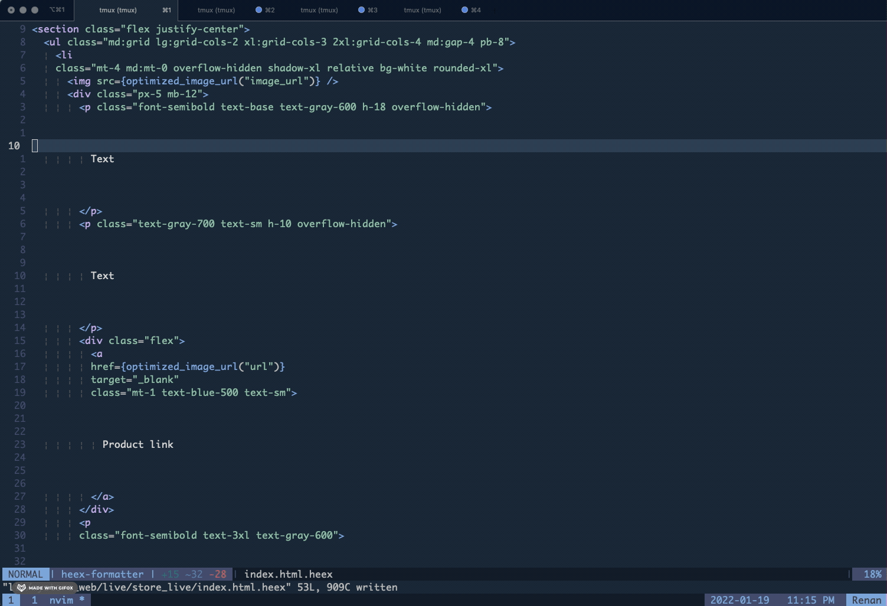

# HeexFormatter

[](https://github.com/feliperenan/heex_formatter/actions/workflows/elixir.yml)

A code formatter for Heex templates.

:warning: This project is still in alpha stage. There are several cases yet to be handled.



### Pre-requisites

* Elixir 1.13
* Phoenix Live View 1.17.7

### Installation

add `:heex_formatter` as dependency

```elixir
defp deps do
  [
    # ...
    {:heex_formatter, github: "feliperenan/heex_formatter"},
  ]
end
```

Add it to your projects `.formatter.exs` file

```elixir
[
  plugins: [HeexFormatter],
  inputs: [
    # ...
    "*.{heex,ex,exs}",
    "{config,lib,test}/**/*.{heex,ex,exs}"
  ],
]
```

Get the deps

```elixir
mix deps.get
```

Compile it

```elixir
mix compile
```

Now run

```elixir
mix format
```

### options

#### line_length

The formatter defaults to a maximum line_length of 98 characters, which can be overwritten with the `line_length` option in the `.formatter` file.

Set `heex_line_length` to only set the line:length for the heex formatter.

```elixir
[
  # ...omitted
  heex_line_length: 300
]
```

Inspired by [Surface Formatter](https://github.com/surface-ui/surface_formatter).
